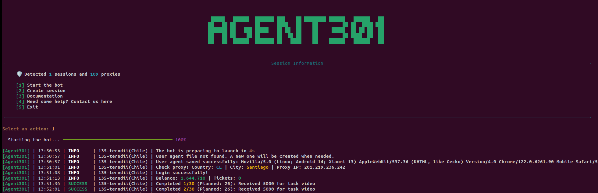

# 🤖 Guid for launching [Agent301](https://t.me/Agent301Bot/app?startapp=onetime6434058521) bot



## Table of Contents

- [Step 1: Preparation](#step-1-preparation)
- [Step 2: Create and Activate Virtual Environment](#step-2-create-and-activate-virtual-environment)
- [Step 3: Install Dependencies](#step-3-install-dependencies)
- [Step 4: Create and Fill .env File](#step-4-create-and-fill-env-file)
- [Step 5: Obtaining API Keys](#step-5-obtaining-api-keys)
- [Step 6: Proxy Setup](#step-6-proxy-setup)
- [Step 7: Create Sessions or Use Existing Ones](#step-7-create-sessions-or-use-existing-ones)
- [Step 8: Run the script](#step-8-run-the-script)
  

> ⚠️ **WARNING**:  
> _Use the script at your own risk. The author of this script is not responsible for any actions taken by users and their consequences, including account bans and other restrictions. We recommend that you exercise caution and avoid sharing confidential information, as this may lead to the compromise of your data. Before using, be sure to review the terms of service of the applications you are working with to avoid violating their rules. Keep in mind that automation may result in unwanted consequences, such as temporary or permanent suspension of your account. Always act consciously and consider the potential risks._


## Need help? Join our community!
If you have any questions or need assistance, feel free to join our **community on Telegram**:

[](https://t.me/web3community_ru)

This project is based on a script from [petyasoft](https://github.com/petyasoft)

---

## Features

| Feature | Supported | 
|---------|-----------|
| Support for pyrogram .session | <div align="center"> ☑️ </div> |
| Multithreading | <div align="center"> ☑️ </div> |
| Proxy binding to session | <div align="center"> ☑️ </div> |
| Generation of User-Agent for each session | <div align="center"> ☑️ </div> |
| Registration via your referral link without restrictions | <div align="center"> ☑️ </div> |
| Earning rewards for referrals | <div align="center"> ☑️ </div> |
| Automatic task execution | <div align="center"> ☑️ </div> |
| Daily reward claim | <div align="center"> ☑️ </div> |

## Settings

| Option                    | Description (default values are provided, you can set your own)                         |
|---------------------------|-----------------------------------------------------------------------------------------|
| **API_ID / API_HASH**     | <small>Telegram platform credentials for starting the session</small>                   |
| **USE_RANDOM_DELAY_IN_RUN**| <small>Run the session with a random delay `True`, without delay `False`</small>       |
| **RANDOM_DELAY_IN_RUN**   | <small>Random delay in the range `[0, 36000]`</small>                                   |
| **REF_CODE**              | <small>Your referral link in the format `onetime6434058521`</small>                     |
| **MINI_SLEEP**            | <small>Delay between bot actions `[7, 20]`</small>                                      |
| **TASK_SLEEP**            | <small>Delay between task executions `[25, 50]`</small>                                 |
| **MAX_SPIN_PER_CYCLE**    | <small>Maximum number of spins in the roulette, default is `5`</small>                  |
| **SLEEP_TIME**            | <small>Time each session sleeps after completing all actions `[21000, 32000]`</small>   |
| **BLACKLIST**             | <small>Tasks that the bot should not perform</small>                                    |
| **USE_PROXY**             | <small>`True` or `False`(default `False`)</small>                                       |


## Step 1: Preparation

   * Ensure that **`Python 3.10`** is installed | Installation guide for [Python](https://www.python.org/downloads/)
   * Download and extract the archive or use the command
     
     ```
     git clone https://github.com/duonanotte/agent301.git
     ```
   * Navigate to the script folder:

      ```
      cd Agent301
      ```
## Step 2: Create and Activate Virtual Environment

* For Windows:
  
     ```
  python -m venv venv
  venv/Scripts/activate
     ```
* For Linux:
    ```
  python3.10 -m venv venv
  source venv/bin/activate
    ```

## Step 3: Install Dependencies

* Install the required libraries:

   ```
   pip install -r requirements.txt
   ```

## Step 4: Create and Fill `.env` File

* In the terminal enter
  
  * For Windows:
     ```
    copy .env-example .env
     ```
  * For Linux:
     ```
    cp .env-example .env
     ```
  
## Step 5: Obtaining API Keys
* Go to [my.telegram.org](https://my.telegram.org) and log in using your phone number.
* Select **"API development tools"** and fill out the form to register a new application.
* Record the `API_ID` and `API_HASH` in the `.env` file, provided after registering your application. For example:
  ```
  API_ID=45698563
  API_HASH=446515f456178894a184
  ```

## Step 6: Proxy Setup

* Fill in the `session_proxy.json` file, linking each account to a separate proxy.
* For automatic filling, add all your proxies to the `proxies.txt` file in format `http://login:password@ip:port` and name your sessions in folder sessions, for example, "1-Andrey", "2-John". If you name the sessions differently, the script will randomly get a proxy for each session.
* In the terminal run the command
  
  ```
  python bot/config/proxies/session_proxy_matcher.py

  ```
* The script will match each proxy line with the account number and add them to the `session_proxy.json` file. This way, you will have a ready-made file where the first proxy line corresponds to the first account, and so on.

## Step 7: Create Sessions or Use Existing Ones

   * To use existing sessions, add them to the `sessions` folder.
   * To create new sessions, run in terminal:
     
     ```
     python main.py

     ```
   * select option "2" in the main menu of the program and follow the prompts 

## Step 8: Run the script

   * Run the script in terminal:
     
     ```
     python main.py

     ```
   * Select option "1" in the main menu, and the script will start running.
